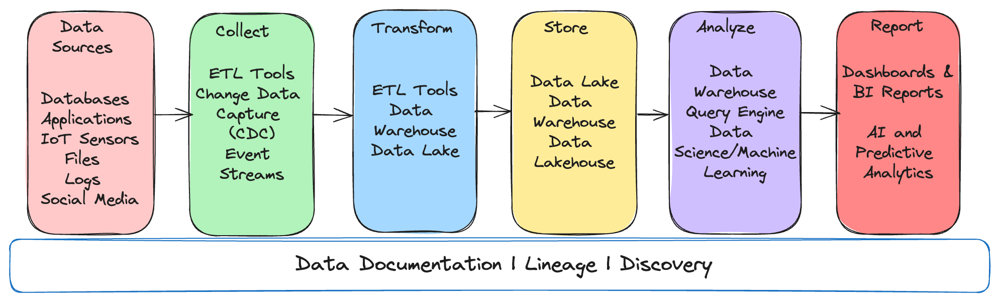

slidenumbers: true
autoscale: true

# Cracking the Code of Data Governance


<br>
### Data Architecture Sydney 2024

---

# Kunal Tiwary

Principal Data Engineer
Latitude Financial Services Australia

 @kktiwa
 @TheKunalTiwary


^ Worked in backend engineering roles for about 10 years
Moved into data and machine learning engineering for over 7 years

---

# Current State
> “If one does not know to which port one is sailing, no wind is favorable.” — [Seneca](https://en.wikipedia.org/wiki/Seneca_the_Younger)


> _Does this data get even used and who uses it?_

> _Who owns this data pipeline?_

>  _Where does this metric come from?_

> _Is this the right formula?_

> _What is PII information in this data asset?_

> _Are we encrpyting this column containing <insert compliance rule>?_

> _This column value doesn't look right for many rows. Can I trust this data?_

---

# So what is the answer?


> The process of maintaining the *availability*, *usability*, *provenance*, and *security* of data.


> _It helps to keep your CFO out of jail card._ :thumbsup:
-- A data leader

---


# Data Pipelines Then

- Basic BI use cases
- Less data sources
- Siloed teams

---


# Data Pipelines Now
- Growing use cases
- Multiple data sources
- Regulations and scrutiny (GDPR)
- Distributed Teams

---	

# 2 Key Catalysts: The Cloud & Metadata

- Cloud-native policies driven by IaaC
- Treating metadata as a first-class citizen


---

# Define common taxonomy
- Abstract common policy and compliance rules
- Use pre-defined IaaC templates
	- Data at rest
	- Data in flight
	- Data serving
- Dark Data [^1]
- Metrics

[^1]:https://www.gartner.com/en/information-technology/glossary/dark-data

---

# Adopt policies as templates

```yaml
{
	retentionPeriodInDays: "1825"
	containsPII: "True"
	containsPCI: "True"
	dataOwner: "Marketing"
	dataClassificationTemplate: "classification-v1.yaml"
}
```

---

# Metadata Pull Pattern
- Pros
	1. Don't need to maintain connector processes
	2. Auto-discover new data points
<br><br><br>
- Cons
    1. Lack of full control on what is being sent

---


# Metadata Push Pattern
- Pros
	1. Full control over what's being sent
<br><br><br>
- Cons
    1. Owning and maintaing collector processes
    2. Unable to get real-time discovery of new data points

---

# Data Quality - The Elephant
Samsung’s $105B "Fat Finger" Data Entry Error

[^2]_In April 2018, Samsung Securities accidentally issued $105 billion worth of shares to employees due to a typo, creating 30 times more shares than in existence. This error led to employees selling $187 million worth of these "ghost shares" within 37 minutes. The fallout saw Samsung Securities' value drop by $300 million._

[^2]: https://www.bloomberg.com/news/articles/2018-04-12/the-105-billion-ghost-stock-blunder-rocking-markets-in-korea

---

# Is there a starting point?
**[^3]Center for Internet Security** (CIS) benchmarks are:
- Prescriptive configuration recommendations for more than 25+ vendor product families
- Consensus-based effort of cybersecurity experts globally

A simple example:

`Profile Applicability`:
Level 1

`Description`:
Lambda functions often have to access a database or other services within your environment.

`Rationale`:
Credentials used to access databases and other AWS Services need to be managed and regularly rotated to keep access into critical systems secure. Keeping any credentials and manually updating the passwords would be cumbersome, but AWS Secrets Manager allows you to manage and rotate passwords.

[^3]: https://www.cisecurity.org/cis-benchmarks

---

# And, is codification enough?

- Decentralised team ownership
- Governance culture at par with software engineering culture
- Establish connection between data, its governance and achieving the enterprise mission

---

# So, are we succeeding?


- Usage Tracking: % unused data
- [^4]Data Quality Score: average DQ score
- Time to detect a violation: observability
- Time to implement a policy change: onboard new policies
- Metric consistency: trust of stakeholders on metrics

_But focus on what's hurting you the most, now_

[^4]:https://resources.montecarlodata.com/c/data-quality-calculator?x=siSBrq