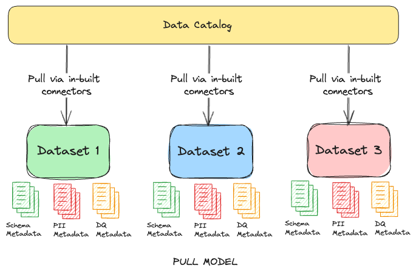

slidenumbers: true
autoscale: true

# Cracking the Code of Data Governance

 
### Data Architecture Sydney 2024

---

# Kunal Tiwary

Principal Data Engineer
Latitude Financial Services Australia

 @kktiwa
 @TheKunalTiwary

^ Worked in backend engineering roles for about 10 years
Moved into data and machine learning engineering for over 7 years

---

## High Level Points
> What is data governance

> Why data governance needs a codified approach

> What does it look like now - Chaos
	Data at rest
	In flight
	Serving layer
	Compliance policies
	Data Data
	Metrics

> What does it look like if you take a engineering approach - Nirvana
> Metadata
…
> But its not just technical…
	Team size / culture
	Approach etc

> Why
  Proactive

> How do you start the journey

> What are the X steps you can take now?
	Metric layer
	Usage tracking 
	Show value quickly by saving cost and reducing risk
	Data quality where it measures
	Codify responsibilities
	Templates
	Review CIS benchmarks?

---

## Data Governance: What is it?

> Data governance is about understanding the data your organization has and having a *structured framework* of roles and responsibilities to manage it. 
This ensures that the *right people* can make *consistent decisions* about the quality and use of your data.

> Both data quality management and data governance are critical data management activities.After all, there’s not much point managing your data if you aren’t sure if it is the right data, or if it is of good enough quality to use.

---

## What should we govern?

+ What should we govern?
	- Data at rest (IaaC driven policies)
	- Data in flight (IaaC driven policies)
	- Data serving layer (IaaC driven policies)
	- Compliance Policies (IaaC driven policies)
	- Dark Data (usage tracking)
	- Metrics (think dbt semantic layer)

---	

## What good governance could look like?

+ Team Shape: Data Stewards, Data Engineers and Data Owners
+ Decentralized ownership: Codifying principles makes it easy
+ Metadata: Metadata is quickly becoming more valuable than the actual data it represents. Build with metadata being a first-class citizen which informs policy decisions
+ Cloud-native policies: Leverage cloud
+ Center for Internet Security (CIS Benchmarks): The CIS Benchmarks are prescriptive configuration recommendations for more than 25+ vendor product families. They represent the consensus-based effort of cybersecurity experts globally to help you protect your systems against threats more confidently.

---

## Metadata Ingestion Patterns

Some common patterns for ingesting metadata are:

---

## Common Pitfalls

- Leaving it too late

^ Too often, data governance only makes it onto the
agenda when data quality issues have caused significant harm, or
when new systems have failed due to poor data quality?

- Siloing responsibility

^ Many business users believe (mistakenly) that
IT owns all data. Use your data governance roles to make it clear who
is responsible for what. Done well, data governance breaks down silos
and improves collaboration within the organization?

- Applying short-term fixes over long-term strategy

^ Data governance can take a long time to implement and deliver value, so
the tendency to opt for quick fixes is understandable. However, shortterm
tactical fixes often have to be repeated regularly, leading to a
culture where “data wrangling” becomes the norm. We need to find
ways of delivering value while developing and implementing a
comprehensive Data Governance Framework to ensure proactive and
ongoing data quality.

- Communicating poorly

---

## What ROI should you measure?

+ Usage
+ Data Quality Levels
+ Violations internal and external
+ Time to detect a violation
+ Time to implement a policy change

---