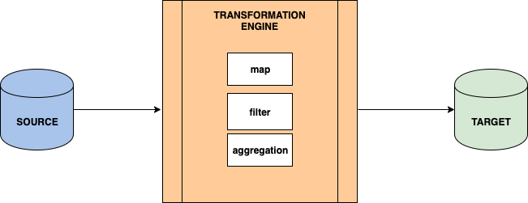
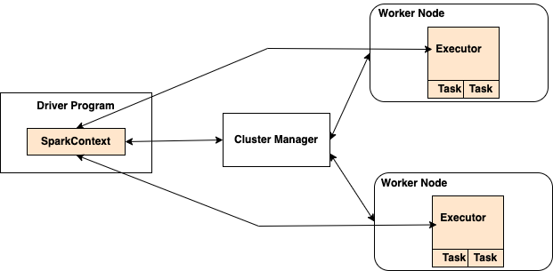
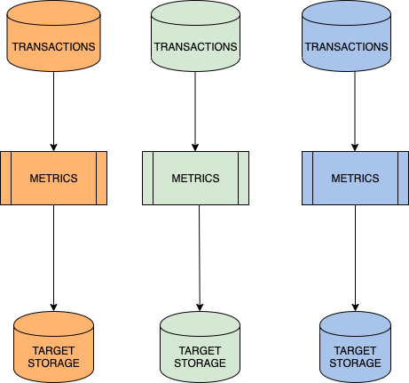

footer: © 2022 Thoughtworks
slidenumbers: true

# Parallelizing Spark data pipelines with ZIO

<br>
### Functional Scala Conference 2022

---
# Kunal Tiwary

Lead Data Engineer
Thoughtworks Australia

 @kktiwa
 @TheKunalTiwary


^ Worked in backend engineering roles for about 10 years
Moved into data and machine learning engineering for over 5 years

---
# Problem Context
+ Critical business metrics
+ No control on dataset availability
+ Shared compute cluster
+ Terabyte scale datasets

^ Example of business metric = `sales lost to a substitute product`
Business metrics were explainable metrics to support anomaly metrics produced by another pipeline
Didn’t have control over source ingestion
Data available on a certain day of the week only
Couldn’t have half the cluster for a day i.e. overcome limitations of a shared compute cluster
Use of full cluster capacity at disposal
Weekly load and a classic pull model batch process

---
# What is a Data Pipeline?



^ Compute engines which can perform transformations

---
# Spark Architecture Components

+ Driver will wait until jobs are completed to submit new ones to executors
+ Operations are __synchronous__ at job level



^ Driver & Executor concept
Spark applications run as independent sets of processes on a cluster, coordinated by the SparkContext object in your main program
Spark acquires executors on nodes in the cluster, which are processes that run computations and store data for your application
Next, it sends your application code (defined by JAR or Python files passed to SparkContext) to the executors. Finally, SparkContext sends tasks to the executors to run.
Finally, SparkContext sends tasks to the executors to run.
Spark cannot run things async by default

---
# Data processing architecture

+ Independent datasets
+ Same data processing logic



^ Why joining all datasets together wasn't a good idea?
Spark needs additional feature to parallelise operations

---
# ZIO Features
+ Simple and easy parallelisation using `foreachPar` and `Fork` & `Join`
+ Simple combinators that allow interop with `Try`, `Either` etc within for-comprehensions
+ Simple to define `retries` & `timeouts`

^ Allowed us to use library functions with different return types

---
# `For each par` example

```scala
val pipelinesToRun = Seq[Task[A]]

val effectToRun =
  for {
    sem <- Semaphore.make(permits = parallelismFactor)
    result <- ZIO.foreachPar(pipelinesToRun) {
      sem.withPermit(_)
    }
  } yield result

val allResults = runtime.unsafeRun(effectToRun)
```

^ `pipelinesToRun` = Seq[Task[A]]
Parallelize multiple runs and return `List[Result]`


---
# `Fork` and `Join` example
```scala
for {
  _ <- ZIO.succeed(logger.info(s"Started processing ${model.name}"))
  firstTask <- ZIO.fromTry(repository.read(model.name)).fork
  secondTask <- Task(repository.read(pathToDataSet)).fork
  firstDataSet <- firstTask.join
  secondDataSet <- secondTask.join
  result <- score(firstDataSet)(secondDataSet)(model)(scoringColumn)
  _ <- ZIO.succeed(logResult(model, result))
} yield result
```
^ Forking any IO[E, A] effect means it will immediately run on a new fiber
A fiber is a lightweight thread of execution
Fibers are spawned by forking IO actions, which, conceptually at least, runs them concurrently with the parent IO action.
Fibers can be joined, yielding their result

---
# `Retries` and `timeout` example

```scala
Task {
  someMap.getOrElseUpdate(key, {
    runSQLAndFetchData(key) match {
      case Success(data) => data
      case Failure(ex) => logger.error(s"Error fetching data ${ex.getMessage}")
        throw new Exception("Error fetching data", ex)
    }
  })
}.retry(Schedule.recurs(2) &&
  Schedule.exponential(2.milliseconds))
  .timeoutFail(new SomeTimeoutException)(10.minutes)
```

^ `someMap` = Cache[String, Dataset[A]] which is a `ConcurrentHashMap` implementation
retry up to 2 times with an exponential wait in between each retry but the total amount of time spent on this task cannot exceed 10 minutes.

---
# Functional Scala Features
+ Typesafe Spark Datasets `Dataset[A]`
+ Typesafe ADTs instead of strings

^ `map` and `flatMap` can be used on `Dataset[A]`
`A` type represents entities such as Customer, Product, Transaction etc

---
# Small Functions Piped Together: An Example

+ Small pure functions grouped into meaningful packages
+ Function currying

```scala
def getMetricsForTargetHierarchy(targetIdColumn: String)
                                (products: Dataset[Product]): Dataset[ProductMetrics] = {
  getActiveTargets(products) |>
    metricsForTargetLevel(targetIdColumn)
}
```

^ Chain together multiple small functions
Currying of functions enables this
Easy testing & debugging (one place to fix)
Enhanced reusability allowing moving into core libraries (domain specific)

---
# Custom pipe operator

Enhanced readability via `Pipe` operator

```scala
implicit class PipeValue[A](x: A) {						
  /**
   * Pipe value x into function f
   */
  def |>[B](f: A => B): B = f(x)
}
```
^ Infix operator takes a value on the left and applies it to the function on the right

---
# Lessons Learnt
+ Spark caching can eat your memory when parallel processing
+ Consider in-memory cache for memoization
+ Keeping differing levels of parallelism configurable
+ Consider [ZparkIO](https://github.com/leobenkel/ZparkIO) if you’re starting today

^ `.persist` called multiple times due to asynchronous operation
Spark doesn't memoize hence the need for an explicit way to memoize via cache
Compute-heavy less parallelism/ less compute heavy more parallelism

---
# Conclusion

+ ZIO features helped us to achieve our SLAs
+ Consider using your compute to the fullest capacity
+ Consider good data modeling practice
+ Small functions promote reuse

^ SLA = Service Level Agreement
Common data model allowed to write a clean & decoupled pipeline
Process more with the compute at your disposal
Write Small functions from the start that'll organically make it easy to pull out common functionality into core modules
